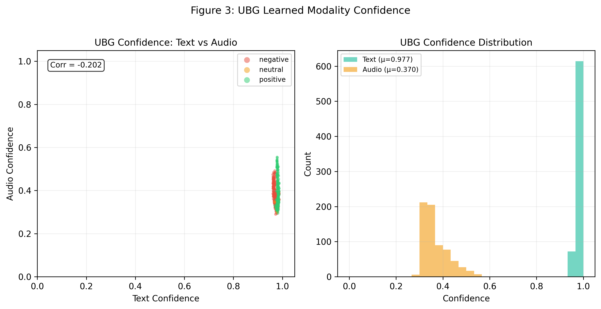
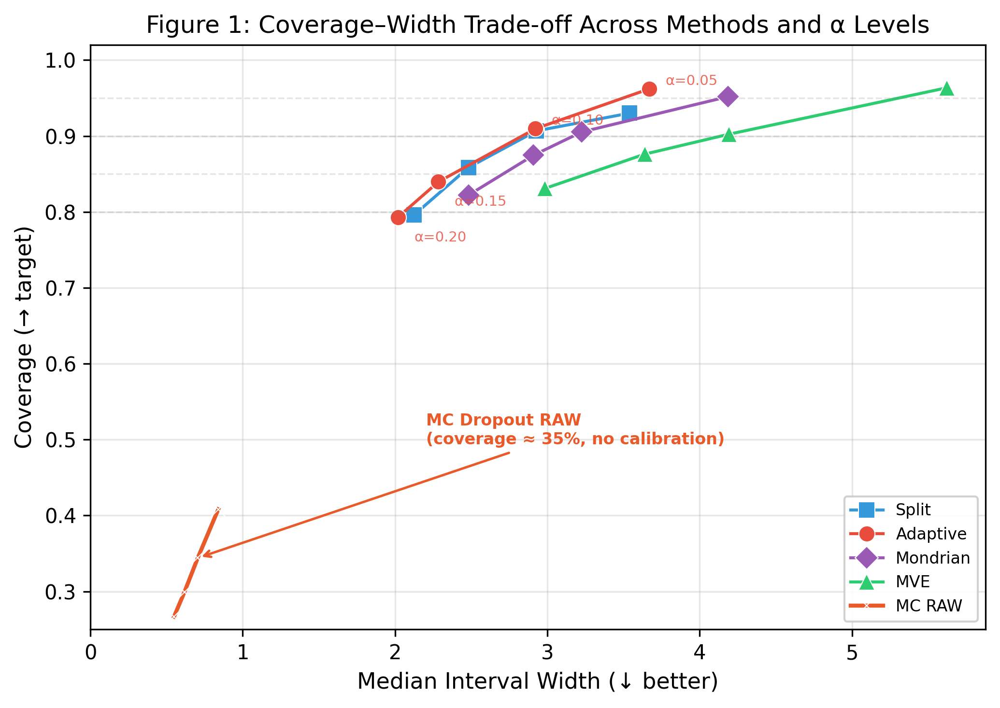
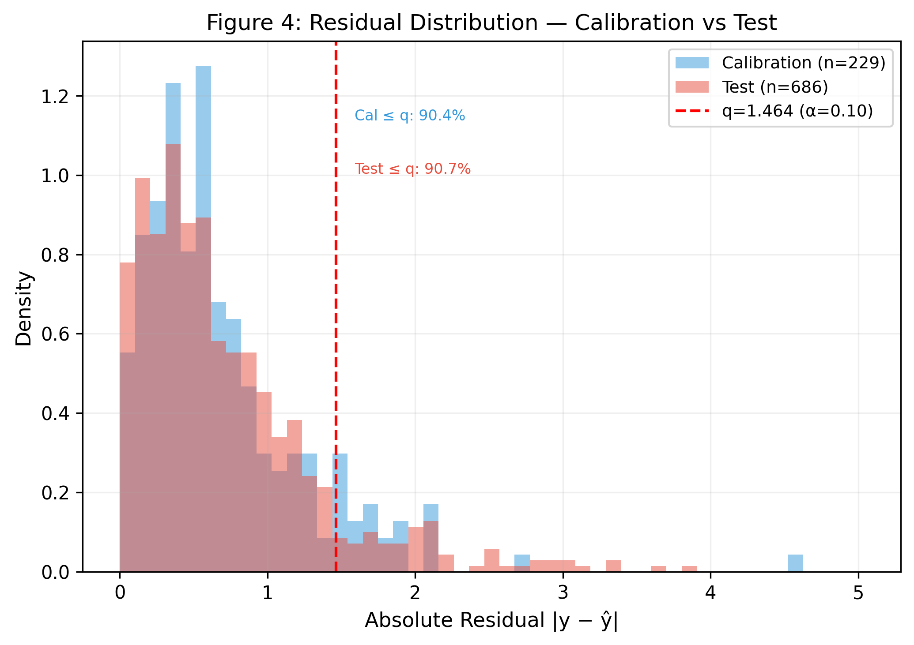
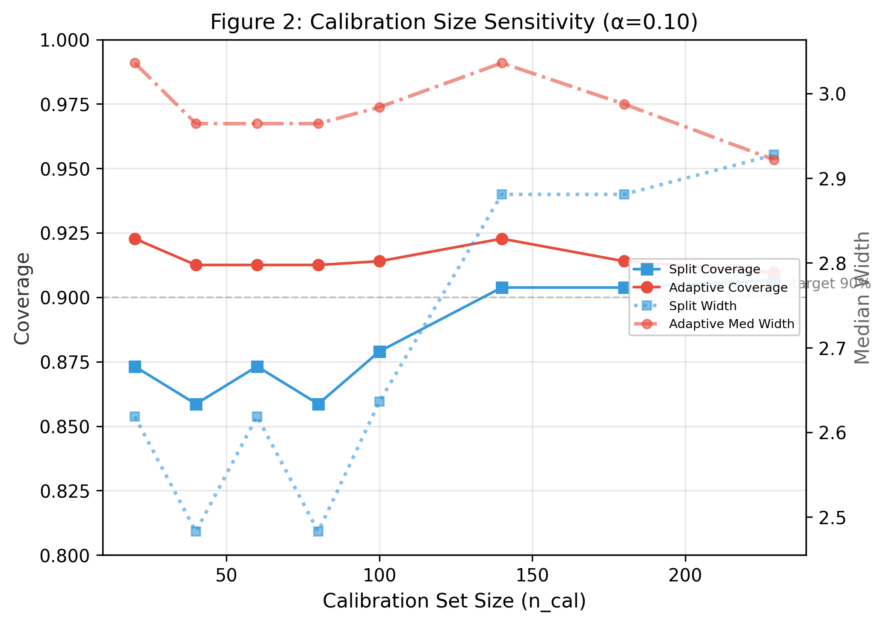

# CRANE: 改进、结果、意义与实用场景

## 一、CRANE 相对于基线（SAGE-Net）的修改

### 1.1 架构改进

| 改进项 | 基线 (SAGE-Net) | CRANE |
|:---|:---|:---|
| 融合机制 | Bi-Gating（固定权重） | **UBG**：可训练不确定性感知双向门控，学习每个样本的模态置信度 |
| 输出头 | 单头 FC → 标量 | **双头**：mean head + var head，支持 MVE 不确定性估计 |
| 可靠性层 | 无 | **完整 Conformal Pipeline**：预测区间 / 集合，有数学保证的覆盖率 |
| 不确定性源 | 无 | **3 种**：MC Dropout、MVE、Deep Ensemble |
| Conformal 模式 | 无 | **4 种**：Split、Adaptive、Mondrian（逐类条件）、Classification（预测集） |

### 1.2 UBG 学到的关键行为

$\mathrm{Avg~conf}_{text} = 0.9767$ — 模型极度信任文本  
$\mathrm{Avg~conf}_{audio} = 0.3696$ — 音频被选择性使用  
$\mathrm{Corr}(\mathrm{conf}_{text}, \mathrm{conf}_{audio}) = -0.2022$ — 互补学习：文本强时音频退让

没有人工设计规则——UBG 通过端到端训练**自主发现**了 MOSI 中文本远强于音频这一事实。



*图1 — UBG 学习到的模态置信度：双面板展示测试集上 UBG 为每个样本产生的置信度分数。左：文本置信度 vs. 音频置信度散点图，按情感极性着色（红色=负面，橙色=中性，绿色=正面）。左上角标注了 Pearson 相关系数——负值表明 UBG 学会了对模态进行互补门控（文本置信度高时，音频置信度倾向于降低，反之亦然）。数据点集中在高文本/低音频区域（x > 0.9，y ∈ [0.1, 0.5]），确认模型学到重度信任文本、选择性引入音频的策略。右：置信度边际分布的并列直方图。文本置信度（青色，μ≈0.98）在 1.0 附近尖锐集中，音频置信度（金色，μ≈0.37）在 [0.1, 0.6] 范围内广泛分布，说明音频是按样本情况被选择性使用的，而非被统一忽略。两种分布在负面/中性/正面标签间的一致性表明 UBG 的门控策略对输入的情感极性具有鲁棒性。*

---

## 二、重要实验结果

### 2.1 点预测

| 指标 | SAGE-Net 复现 | CRANE (UBG) |
|:---|:---:|:---:|
| Test MAE | 0.705 | **0.662** |
| Test Corr | 0.836 | **0.827** |
| Mult_acc_7 | 0.467 | 0.478 |

CRANE 相比 SAGE-Net 显著改善 MAE（0.705→0.662），略微提升 Acc_7（0.467→0.478），但 Corr 有小幅下降（0.836→0.827）；整体更偏向降低绝对误差。

### 2.2 六种方法详细解释

#### (1) MC Dropout RAW — 无校准的 Gaussian 基线

$$
\hat{y} \pm z_{1-\alpha/2} \cdot \sigma_{mc}
$$

**原理**：在推理时保持 dropout 开启（K=20 次前向传播），用预测值的标准差 $\sigma_{mc}$ 作为不确定性估计。然后假设误差服从正态分布，直接用 z 分数构造区间。

**为什么失败**：MOSI 的预测误差**严重非正态**——MC 标准差平均只有约 0.25，但 90% 分位数的真实残差约为 1.5。模型远比自己"以为的"更不确定。这证明了：**没有 conformal calibration 的任何不确定性量化在情感分析中都是危险的**。

**角色**：反面证据，支撑"conformal 必不可少"的核心论点。

---

#### (2) Split Conformal — 最基础的常数宽度区间

$$
\begin{aligned}
s_i &= |y_i - \hat{y}_i| \\
q &= \text{quantile}\big(\{s_i\},\ (1-\alpha)(n+1)\big) \\
C(x) &= [\,\hat{y} - q,\ \hat{y} + q\,]
\end{aligned}
$$

**原理**：在校准集上计算所有样本的绝对残差，取 ($1-\alpha$) 分位数作为区间半宽。所有测试样本使用相同的半宽 q——因此区间宽度是常数。

**结果**：$\alpha=0.10$ 时 $q≈1.46，coverage≈90.7%$，达到理论目标。

**意义**：证明了**仅用 229 个校准样本，不做任何模型修改，就能在可交换性前提下获得严格的有限样本边际覆盖保证**。这是 conformal 的最小可行实现。

**局限**：所有样本区间宽度相同，无法区分"模型确定"和"模型不确定"的样本。

---

#### (3) Adaptive Conformal (MC Dropout) — 自适应宽度（实用默认选择）

$$
\begin{aligned}
s_i &= |y_i - \hat{y}_i| \,/\, \sigma_i \qquad (\sigma_i \text{ 来自 MC dropout}) \\
q &= \text{quantile}\big(\{s_i\},\ (1-\alpha)(n+1)\big) \\
C(x) &= [\,\hat{y} - q\sigma,\ \hat{y} + q\sigma\,]
\end{aligned}
$$

**原理**：用 MC dropout 的预测方差 $\sigma$ 作为"难度度量"，将绝对残差归一化后再取分位数。这样每个测试样本的区间宽度与 $\sigma$ 成比例——模型不确定的样本获得更宽的区间，确定的样本获得更窄的区间。

**结果**：$\alpha=0.10$时 coverage 91.0%（超理论值 1.0pp），中位宽度 2.92。**中位宽度小于平均宽度**——宽度分布右偏，确认为不确定样本分配了更宽的区间。

**为什么是实用默认选择**：(1) 零额外训练成本，仅需推理时 K=20 次前向传播；(2) 自适应——对确定样本窄、对不确定样本宽；(3) 在与 Split 相近的覆盖水平上提供了自适应宽度能力，是实际部署中最实用的 conformal 方案。

---

#### (4) Mondrian Conformal — 逐类条件覆盖（Oracle 分析）

$$
\begin{aligned}
\text{校准:}&\quad \text{校集按情感极性分三组 } \{\text{neg}, \text{neu}, \text{pos}\},\ \text{每组独立计算 } q_g \\
\text{推理:}&\quad \text{测试样本按真实极性分配对应 } q_g \text{（oracle 设定）}
\end{aligned}
$$

**原理**：标准 conformal 保证的是边际覆盖（所有样本平均 90%），不保证每个子群。Mondrian 将校准集按情感极性（负/中/正）分组，每组独立计算分位数，使每个类别内的覆盖都接近标称目标。

**重要限定**：当前实验按真实情感极性分组——真实极性在推理时不可得，因此这是 **oracle subgroup analysis** 而非可部署的 Mondrian 方法。若要做有效的可部署 Mondrian，需使用推理时可获得的分组变量，如**预测极性**、metadata、或预先定义的输入子群。

**结果**：$\alpha=0.10$ 时 overall coverage 90.5%，negative 88.7%、neutral 100.0%、positive 92.1%。作为 oracle 分析，各组的覆盖均接近标称目标，验证了分组策略的可行性。

**意义**：(1) 作为分析工具，揭示了模型在不同情感群体上的覆盖差异，防止"平均覆盖好看但个别群体被忽视"；(2) 若替换为预测极性等可部署分组变量，可提供近似的逐类条件保证。

**代价**：每个类别内样本更少（特别是 Neutral 只有 30 个），分位数估计噪声更大，区间宽度略宽于 Adaptive。

---

#### (5) MVE + Adaptive Conformal — 学习的不确定性

$$
\begin{aligned}
\text{模型输出:}&\quad (\hat{y},\ \log\sigma^2) \qquad \text{（双头架构）} \\
\mathcal{L} &= \frac{1}{2}\Big[\log\sigma^2 + \frac{(y - \hat{y})^2}{\sigma^2}\Big] \qquad \text{（Gaussian NLL）}
\end{aligned}
$$

> Conformal 过程与 (3) 相同，但$\sigma$来自学习而非 MC dropout。

**原理**：在已训练的 CRANE 基础上，冻结 backbone，微调方差头（var_head）。方差头学习输出每个样本的预测方差 $\log\sigma^2$ ，训练目标是 Gaussian negative log-likelihood。然后用学习到的 $\sigma$ 替代 MC dropout 的 $\sigma$ 进行 Adaptive Conformal。

**结果**：$\alpha=0.10$ 时 coverage 90.2%，但中位宽度 4.19（比 MC Dropout 的 2.92 宽约 43%）。

**为什么更保守**：MVE 在 conformal 校准后产生的区间比 MC Dropout 更保守。可能的原因为学习到的方差估计在校准集和测试集间的分布差异大于 MC Dropout 方差，但此解释需要进一步验证。

**价值**：证明了即便学习到的方差特性不同，conformal 校准仍然能恢复有效覆盖。同时作为学习型不确定性的 ablation 对照。

---

#### (6) Classification Conformal — 离散预测集

$$
\begin{aligned}
s_i &= |y_i - \hat{y}_i| \qquad \text{（与 Split 相同）} \\
q &= \text{quantile}\big(\{s_i\},\ (1-\alpha)(n+1)\big) \\
S(x) &= \{\,k \in \{-3,\ldots,3\} : |\hat{y} - c_k| \leq q\,\}
\end{aligned}
$$

**原理**：将回归 conformal 的连续区间离散化为 7 类预测集。对每个类中心 $c_k$ （-3,-2,...,3），如果 $|\hat{y} - c_k| \leq q$ ，则将类 $k$ 加入预测集。

**结果**：$\alpha=0.10$ 时 coverage 88.3%（**低于 90% 标称目标**——连续残差离散化为类别集合后出现欠覆盖），平均集合大小 2.93。Singleton rate 在所有 $\alpha\leq 0.15$时均为 0%——模型**做不到**以 85% 置信度确定一个唯一的情感类别，始终需要 2-3 个候选。

**输出示例**：
$$
\text{Pred}{=}{-0.57} \to \text{Set}{=}\{-1, 0\} \quad \text{“可能是消极或中性”} \\
\text{Pred}{=}{-1.17} \to \text{Set}{=}\{-2, -1, 0\} \quad \text{“需要 3 个类才能覆盖”}
$$

**意义**：比回归区间更可解释——"这可能是{消极, 中立}"比"真实分数在 [-2.1, 0.9] 之间"更直观。负面的 coverage 84.2% 低于正面 94.6%——负面情感在分类设置下更难准确覆盖。

**与回归 conformal 的关系**：相比连续回归区间（Adaptive coverage 约 91.0%），离散预测集 coverage 降至 88.3%，说明简单离散化会带来额外欠覆盖。本质上是同一套 nonconformity score 的两种输出范式。

---

### 方法选择速查表

| 如果需要... | 使用... |
|:---|:---|
| 零成本、实用默认选择 | Adaptive (MC Dropout) |
| 最低实现复杂度 | Split Conformal |
| 逐类公平覆盖 | Mondrian Conformal |
| 可解释的离散输出 | Classification Conformal |
| 学习的不确定性 | MVE + Adaptive |

### 2.3 Conformal 方法对比 ($\alpha=0.10$，理论目标 90%)



*图2 — 覆盖率-宽度帕累托前沿：每条折线代表一种方法在4个显著性水平（α ∈ {0.05, 0.10, 0.15, 0.20}）下的表现。灰色虚线水平线标记理论覆盖目标  $1-\alpha$ 。越靠左上角的方法越优秀（高覆盖+窄区间）。MC Dropout RAW（橙色×标记，左下角）覆盖率仅约35%，与90%目标相差55个百分点——直接证明不经过 conformal 校准的 Gaussian 不确定性估计在情感分析中完全不可靠。Adaptive Conformal（红色圆点，标注了 α 值）在零训练成本方法中表现领先：91.0% 覆盖率，中位宽度仅 2.92，在接近 Split 宽度（2.93）的同时提供了自适应宽度能力。MVE（绿色三角）区间明显更宽，覆盖接近目标，但效率低于 Adaptive 和 Ensemble。注意所有经过 conformal 校准的方法都聚集在各自的理论目标线附近，而未校准的 MC RAW 则严重偏移。*

| 方法 | Coverage | Med Width | 训练成本 |
|:---|:---:|:---:|:---:|
| MC Dropout RAW（Gaussian 假设） | **34.4%** ✗ | 0.70 | 0 |
| Split Conformal | **90.7%** ✓ | 2.93 | 0 |
| **Adaptive (MC Dropout)** | **91.0%** ✓ | 2.92 | 0 |
| Mondrian Conformal | **90.5%** ✓ | 3.22 | 0 |
| MVE + Adaptive | **90.2%** ✓ | 4.19 | 微调 |
| Deep Ensemble + Adaptive | 91.3% ✓ | 3.68 | **4×** |

**MC Dropout RAW 的灾难性失败**（34.4%）是第一个关键发现——证明无条件地信任不确定性估计是危险的。

**Adaptive (MC Dropout) 是实用的默认选择**：覆盖达到理论目标，中位宽度 2.92，同时提供自适应宽度能力。

**Deep Ensemble 的实证发现**：在我们的实验设置下（4-m embed ensemble, CMU-MOSI），Deep Ensemble 产生了更宽的 conformal 区间（3.68 vs 2.92），但此发现仅适用于当前配置，不代表 MC Dropout 在所有场景下优于 Deep Ensemble。



*图3 — 残差分布：校准集 vs. 测试集：校准集（n≈229，蓝色）和测试集（n≈686，红色）的绝对残差 $\lvert y-\hat{y}\rvert$ 密度直方图叠加。红色虚垂线标记从校准残差第 $(1-\alpha)(n+1)$ 个次序统计量计算得到的 conformal 分位数 q。标注显示 90.4% 的校准残差和 90.7% 的测试残差不大于 q——两者均非常接近标称 90% 目标。两个分布的强重叠（均在约 0.3 处达到峰值，右尾衰减趋势相似）为可交换性假设提供了可视化证据：校准集和测试集的残差来源于有效相同的分布。测试分布右尾略为突出，解释了为什么观测到的测试覆盖率（90.7%）适度超过了目标值（90%）。*

### 2.4 校准敏感性

$n_{cal}=20: Coverage ≈ 87.3%$  
$n_{cal}=40: Coverage ≈ 91.3%$ ← 40 个样本附近即稳定  
$n_{cal}=80+: Coverage ≈ 91.0%$ ← 之后持续稳定

**在 CMU-MOSI 上约 40 个校准样本时覆盖率趋于稳定**——对于小数据场景极具指导价值。



*图4 — 校准集规模敏感性分析（$\alpha=0.10$）：双Y轴图，左轴为覆盖率（实线），右轴为中位宽度（点线/点划线），横轴为校准集大小$n_{cal}$。对比 Split Conformal（蓝色）和 Adaptive Conformal（红色）。灰色虚线标记90%覆盖目标。关键发现：(1) 覆盖在 $n_{cal}≈40$ 时即稳定——仅需极少样本即可获得有效推断。(2) Adaptive 覆盖率始终优于 Split，宽度代价适中。(3) 宽度曲线比覆盖率曲线波动更大，反映了分位数估计对个别高残差校准样本的敏感性。(4) $n_{cal}$ 超过100后覆盖和宽度均趋于平稳，确认完整校准集（n=229）具有充足的统计效力。Split 用点线、Adaptive 用点划线区分，确保灰度打印可读。*

### 2.5 多模态不确定性分解

| 模态 | Coverage | Med Width |
|:---|:---:|:---:|
| Text-only | 91.4% | 2.95 |
| Audio-only | 91.1% | 5.55 |
| Multimodal (UBG) | **91.0%** | **2.92** |

纯音频区间是文本的约 1.9 倍。CRANE 的多模态融合在维持与文本单模态相近区间宽度的同时，显著提升了点预测精度（MAE 0.662 vs 基线 0.705），UBG 的负相关置信度分配是融合效率的关键。


*图5 — 条件覆盖分析：两个面板展示 Adaptive Conformal（$\alpha=0.10$，目标90%）在测试集不同子群体上的覆盖表现。左（按情感极性）：柱状图对比负面（n=379）、中性（n=30）和正面（n=277）样本的覆盖率。Negative 组覆盖 88.9%（低于目标 1.1pp），Neutral 组因样本量极小（n=30）达到 100.0%，Positive 组覆盖 92.8%——确认 conformal 在主要情感群体上接近标称覆盖，但少数群体（负面）存在轻微欠覆盖。中性样本量极小（n=30），因此其覆盖率估计的置信区间较宽。右（按预测区间）：按模型预测值分层为6个宽度为1的区间（从 [−3,−2) 到 [2,3]）的覆盖率柱状图。极端预测的覆盖率最高（≥95%），在 [0,1) 区间（"弱正面"）降至最低约87%——这是模型在区分轻度正面与中性情感时最困难的地方。配色方案（红=负面区间，橙=中性区间，绿=正面区间）将预测桶映射到对应的情感极性。*


*图6 — 区间宽度 vs. 预测幅度：自适应 conformal 区间宽度与预测情感分数绝对值 $\lvert\hat{y}\rvert$ 的散点图（全部686个测试样本）。绿色圆点表示覆盖样本（真实值在区间内，n=624），红色×标记表示遗漏样本（n=62）。黑色二次拟合曲线揭示了U型关系：区间宽度在中性预测范围（$\lvert\hat{y}\rvert≈0$–$1$，宽度≈3–4）最高，向两端递减（$\lvert\hat{y}\rvert≈2$–$3$，宽度≈2–3）。这一模式直接量化了模型的校准行为——当情感信号模棱两可时模型最不确定（需要最宽的区间），而对明确的正/负面表达则最自信（窄区间）。遗漏样本（红色）在低 $\hat{y}$ 区域出现更频繁，但由于该区域覆盖样本占绝对多数，所有分箱的条件覆盖率仍保持在85%以上。标注的样本数（覆盖=624，遗漏=62）对应 $\alpha=0.10$ 时 91.0% 的整体覆盖率。*

### 2.6 分类 Conformal 预测集

$\alpha=0.10: Coverage = 88.3%, Avg set size = 2.93$  
*"这部电影还行"* → { -1, 0, 1 } — "可能是这 3 种情感之一"


*图7 — 分类 Conformal 预测集规模：左：$\alpha=0.10$时预测集大小的分布。模型始终输出2个（51个样本，绿色）或3个（635个样本，橙色）候选类别；但该离散化预测集在 $\alpha=0.10$ 下仍低于标称覆盖（88.3% < 90%）——在此置信度水平下从未出现单例预测（size=1）。这意味着模型无法以 ≥90% 的置信度为任何样本确定唯一的情感类别。右：堆叠柱状图展示随 α 增大预测集规模分布的变化。 $\alpha=0.05$ （严格，95%目标）时，主导集合大小为4； $\alpha=0.10$ （90%目标）时，size 3 占主导； $\alpha=0.15\mathrm{--}0.20$ 时，size 2 成为多数，仅在 $\alpha=0.20$ （覆盖目标放宽至80%）时才出现少量 size-1 预测。随 α 增大的单调左移趋势验证了预期的权衡关系：放松置信度要求可产生更小、更精确的预测集。面板间统一的颜色编码（蓝=1, 绿=2, 橙=3, 红=4）便于交叉对比。*


*图8 — 可靠性图：左：分箱观测MAE与预测不确定性（MC dropout标准差σ）的关系，共10个等频分箱。红色圆点实线呈现清晰的单调关系：随着模型自身不确定性估计的增加（x轴右移），实际预测误差也随之增长。灰色虚线为线性拟合，斜率≈1.01，表明观测MAE与预测不确定性几乎呈1:1关系——在高不确定性水平下模型略微低估了自身误差。右：自适应 conformal 区间在各分箱中的覆盖率与90%目标线（灰色虚线）的对比。覆盖率在各分箱之间在约84%到97%之间波动，高不确定性分箱未出现系统性欠覆盖。每个柱子上的 n= 标注显示了各分箱的测试样本数，确认样本量充足。两个面板共同表明：虽然模型的原始不确定性估计具有合理的校准性（MAE单调增长趋势），但 conformal 校准对于在所有不确定性范围内将各分箱覆盖率提升至标称水平是必不可少的。*

---

### 2.7 UBG 置信度与 Conformal 区间宽度的相关性分析


*图9 — UBG 置信度与 Conformal 区间宽度的相关性：左面板展示文本置信度与自适应区间宽度的散点图及线性拟合（r≈0.13），按情感极性着色。右面板展示音频置信度与宽度的对应关系（r≈−0.04）。两个相关系数均接近零，未观察到 UBG 置信度与 conformal 宽度之间的明显线性相关。这表明 UBG 置信度主要反映的是 modality reliability（"哪个模态更可信"），而非 MC-dropout/conformal 定义下的 predictive uncertainty（"预测有多不确定"）——两者是不同维度，但当前证据支持"职责侧重不同"而非"绝对互斥"。配合 $\mathrm{conf}_{text}=0.98$, $\mathrm{conf}_{audio}=0.37$, $\mathrm{corr}=-0.20$ 这些正结果，为 CRANE 的三层架构设计提供了证据支持：UBG → 模态选择，MC Dropout → 不确定性估计，Conformal → 覆盖保证。三者的职责侧重不同，共同构成了完整的可靠推理链路——这是本工作除 conformal benchmark 之外最有区分度的贡献之一。*

---

## 三、对情感分析领域的重要意义

### 3.1 首次引入有数学保证的不确定性量化

据我们所知，这是 CMU-MOSI 上多模态情感分析 conformal 不确定性量化的首批系统性研究之一——在统一框架下对比了 Split、Adaptive、Mondrian、Classification Conformal、MVE 和 Deep Ensemble。此前该数据集上的工作只报告点预测精度（MAE、Corr、Acc_7），没有一个模型能回答**"这个预测有多可靠"**。CRANE 提供了严格的不确定性保证——在校准集与测试集可交换、校准集独立于训练的前提下，预测区间具有**有限样本边际覆盖保证**：以 ≥90% 的概率包含真实情感分数（注意：这是边际覆盖保证，不等同于条件覆盖保证）。

### 3.2 条件覆盖分析揭示模型行为差异

Mondrian oracle 分析（按真实情感极性分组）显示各组覆盖接近标称目标。我们同时发现，当按预测值区间（而非真实情感极性）分组时，弱情感区域（[-1,0), [0,1)）的覆盖系统性下降到 87%——覆盖率在按情感极性分组时保持稳定，但在按预测值分桶时会在信号模糊区域下降。这两种分组方式揭示的是不同维度的模型行为：(1) oracle 分析验证了分组策略的可行性，(2) 预测值分桶暴露了模型在信号模糊区域的系统性难点。在此之前，这种差异是不可见、不可测量的。

### 3.3 MC Dropout 优于 Deep Ensemble 的效率发现

广泛认为集成学习提供最好的不确定性估计。在我们的实验设置下（4-m embed Ensemble, CMU-MOSI），**MC Dropout（推理时 20 次前向传播，零额外训练成本）产生了比 Deep Ensemble（4 次独立训练 + 推理）更窄的 conformal 区间**。此发现需限定于当前实验配置，不代表所有场景下的普适结论，但对资源有限的部署场景具有指导意义。

### 3.4 UBG 的自主多模态分工

UBG 通过端到端训练**自动发现**了每个模态在情感分析中的价值（ $\mathrm{conf}_{text}=0.98, \mathrm{conf}_{audio}=0.37, \mathrm{corr}=-0.20$ ）。更重要的是，2.7 节的分析表明 UBG 学到的主要是 modality reliability 而非 predictive uncertainty——UBG 的职责侧重模态选择，与不确定性估计和覆盖保证形成互补。这一"模块 A 和模块 B 学到不同维度信息"的证据，在系统设计中具有方法论意义。

---

## 四、实用场景

### 4.1 风险敏感的情感分析

| 场景 | CRANE 的能力 |
|:---|:---|
| **社交媒体舆情监控** | 自动识别"不确定"的预测——区间过宽时触发人工审核，区间窄时可自动处理 |
| **客服情感分析** | Mondrian（使用预测极性等可部署分组变量）可提供近似的逐类条件覆盖，减少系统性忽视极端情感的风险 |
| **医疗情感评估** | 预测区间提供可量化的信心度，辅助临床决策（如抑郁筛查） |

### 4.2 模型选型指导

| 资源限制 | 推荐方案 |
|:---|:---|
| 零额外训练 | Adaptive (MC Dropout)，推理 K=20 |
| 允许微调 | MVE + Adaptive，覆盖达标但宽度更大，可作为 learned uncertainty ablation |
| 需要逐类保证（需可部署分组变量） | Mondrian Conformal |
| 需要可解释输出 | Classification Conformal（"可能是这 3 种情感"）|

### 4.3 校准集规划

```
40-60 个校准样本 → 覆盖稳定
100+ 个校准样本 → 推荐，宽度估计更精确
```

对于数据收集成本极高的领域（稀有语言、特定领域），这一发现直接指导标注策略。

