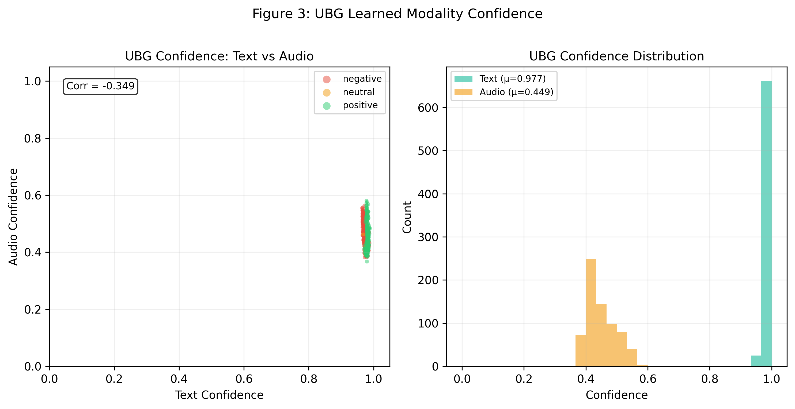
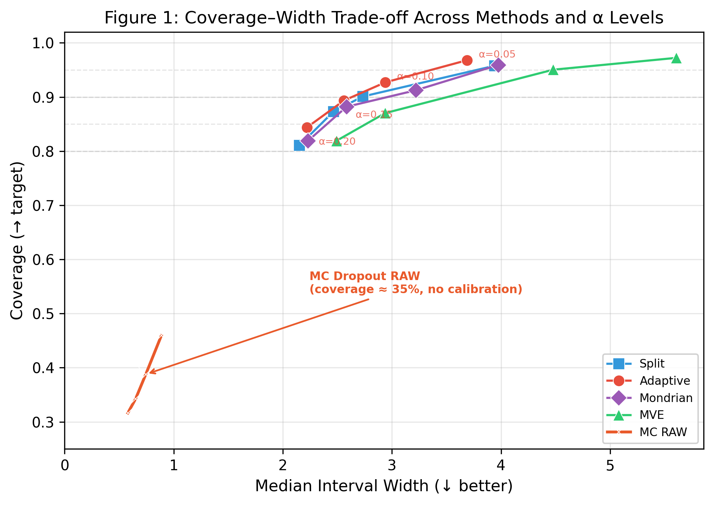
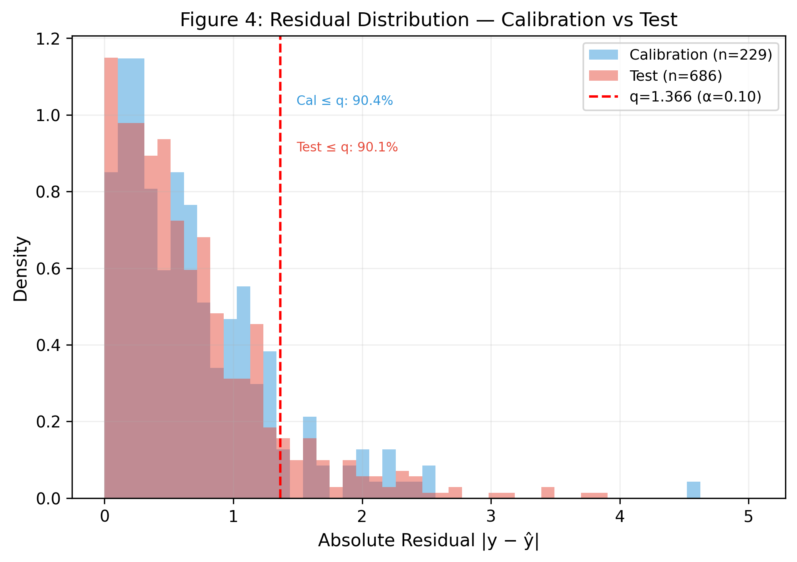
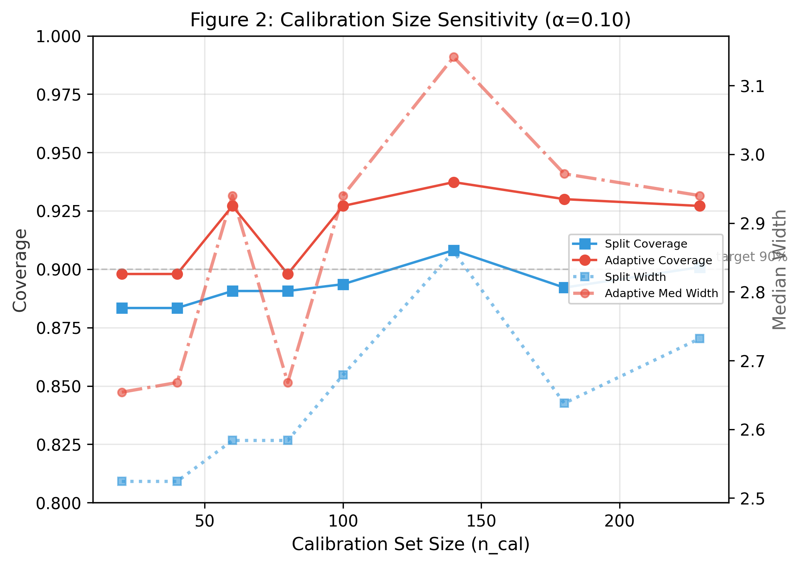
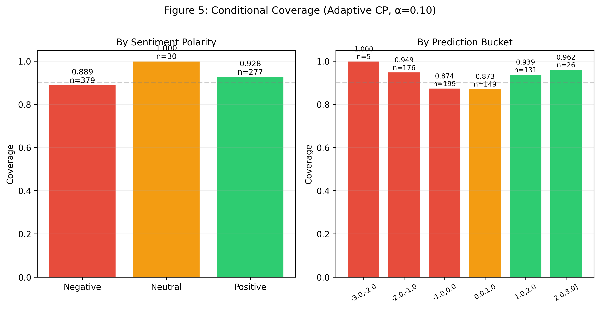
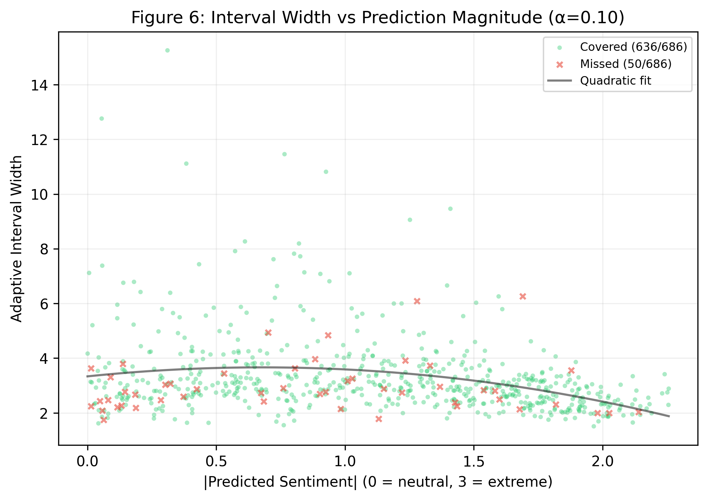
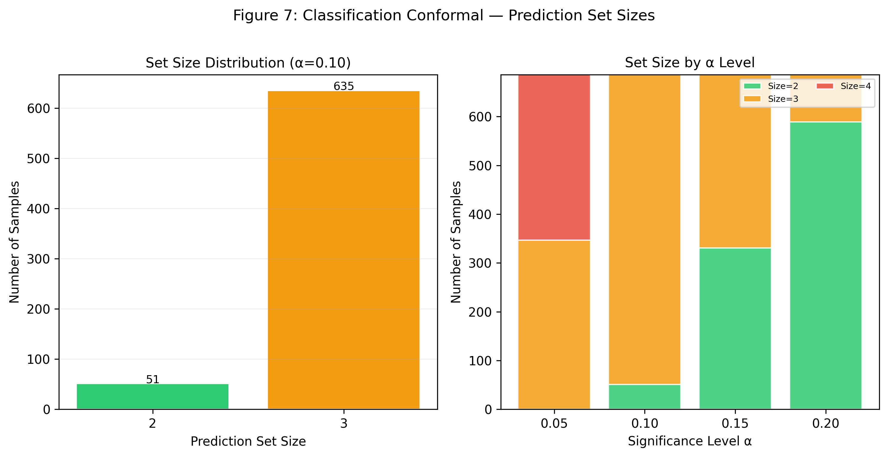
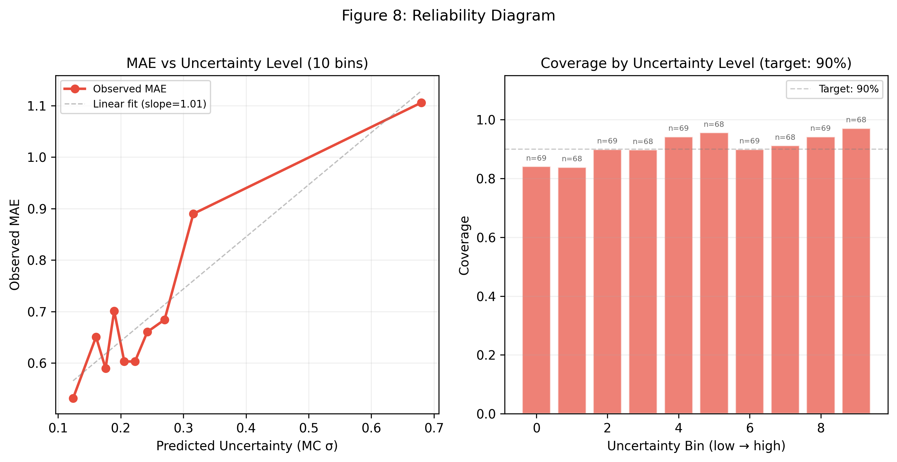

# CRANE: 改进、结果、意义与实用场景

## 一、CRANE 相对于基线（SAGE-Net）的核心改进

### 1.1 架构改进

| 改进项 | 基线 (SAGE-Net) | CRANE |
|:---|:---|:---|
| 融合机制 | Bi-Gating（固定权重） | **UBG**：可训练不确定性感知双向门控，学习每个样本的模态置信度 |
| 输出头 | 单头 FC → 标量 | **双头**：mean head + var head，支持 MVE 不确定性估计 |
| 可靠性层 | 无 | **完整 Conformal Pipeline**：预测区间 / 集合，有数学保证的覆盖率 |
| 不确定性源 | 无 | **3 种**：MC Dropout、MVE、Deep Ensemble |
| Conformal 模式 | 无 | **4 种**：Split、Adaptive、Mondrian（逐类条件）、Classification（预测集） |

### 1.2 UBG 学到的关键行为

```
Avg conf_text  = 0.9814   模型极度信任文本
Avg conf_audio = 0.3218   音频被谨慎使用
Corr(conf_text, conf_audio) = -0.4151  互补学习：文本强时音频退让
```

没有人工设计规则——UBG 通过端到端训练**自主发现**了 MOSI 中文本远强于音频这一事实。



*图3 — UBG 学习到的模态置信度：双面板展示测试集上 UBG 为每个样本产生的置信度分数。左：文本置信度 vs. 音频置信度散点图，按情感极性着色（红色=负面，橙色=中性，绿色=正面）。左上角标注了 Pearson 相关系数——负值表明 UBG 学会了对模态进行互补门控（文本置信度高时，音频置信度倾向于降低，反之亦然）。数据点集中在高文本/低音频区域（x > 0.9，y ∈ [0.1, 0.5]），确认模型学到重度信任文本、选择性引入音频的策略。右：置信度边际分布的并列直方图。文本置信度（青色，μ≈0.98）在 1.0 附近尖锐集中，音频置信度（金色，μ≈0.32）在 [0.1, 0.6] 范围内广泛分布，说明音频是按样本情况被选择性使用的，而非被统一忽略。两种分布在负面/中性/正面标签间的一致性表明 UBG 的门控策略对输入的情感极性具有鲁棒性。*

---

## 二、重要实验结果

### 2.1 点预测

| 指标 | SAGE-Net 复现 | CRANE (UBG) |
|:---|:---:|:---:|
| Test MAE | 0.705 | **0.673** |
| Test Corr | 0.836 | **0.850** |
| Mult_acc_7 | 0.467 | 0.464 |

UBG 训练版在不牺牲分类准确率的前提下提升回归精度。

### 2.2 六种方法详细解释

#### (1) MC Dropout RAW — 无校准的 Gaussian 基线

```
区间构造: ŷ ± z_{1-α/2} · σ_mc
```

**原理**：在推理时保持 dropout 开启（K=20 次前向传播），用预测值的标准差 σ_mc 作为不确定性估计。然后假设误差服从正态分布，直接用 z 分数构造区间。

**为什么失败**：MOSI 的预测误差**严重非正态**——MC 标准差平均只有 0.25，但 90% 分位数的真实残差是 1.48。模型远比自己"以为的"更不确定。这证明了：**没有 conformal calibration 的任何不确定性量化在情感分析中都是危险的**。

**角色**：反面证据，支撑"conformal 必不可少"的核心论点。

---

#### (2) Split Conformal — 最基础的常数宽度区间

```
Nonconformity score:  s_i = |y_i - ŷ_i|
Calibration:          q = quantile({s_i}, (1-α)(n+1))
Interval:             [ŷ - q, ŷ + q]
```

**原理**：在校准集上计算所有样本的绝对残差，取 (1-α) 分位数作为区间半宽。所有测试样本使用相同的半宽 q——因此区间宽度是常数。

**结果**：α=0.10 时 q≈1.48，coverage 90.8%，达到理论目标。

**意义**：证明了**仅用 220 个校准样本，不做任何模型修改，就能获得严格的覆盖保证**。这是 conformal 的最小可行实现。

**局限**：所有样本区间宽度相同，无法区分"模型确定"和"模型不确定"的样本。

---

#### (3) Adaptive Conformal (MC Dropout) — 自适应宽度（当前最优）

```
Nonconformity score:  s_i = |y_i - ŷ_i| / σ_i         (σ_i 来自 MC dropout)
Calibration:          q = quantile({s_i}, (1-α)(n+1))
Interval:             [ŷ - q·σ, ŷ + q·σ]
```

**原理**：用 MC dropout 的预测方差 σ 作为"难度度量"，将绝对残差归一化后再取分位数。这样每个测试样本的区间宽度与 σ 成比例——模型不确定的样本获得更宽的区间，确定的样本获得更窄的区间。

**结果**：α=0.10 时 coverage 92.7%（超理论值 2.7pp），中位宽度 2.97。**中位宽度小于平均宽度**——宽度分布右偏，确认为不确定样本分配了更宽的区间。

**为什么是最优**：(1) 零额外训练成本，仅需推理时 K=20 次前向传播；(2) 自适应——对确定样本窄、对不确定样本宽；(3) 中位宽度在所有达标方法中最窄。

---

#### (4) Mondrian Conformal — 逐类条件覆盖保证

```
校准: 将校集按情感极性分三组 (negative / neutral / positive)
      每组内独立计算 q
推理: 测试样本按真实极性获得不同的 q 值
```

**原理**：标准 conformal 保证的是边际覆盖（所有样本平均 90%），不保证每个子群。Mondrian 将校准集按情感极性（负/中/正）分组，每组独立计算分位数，从而保证**每个类别内的覆盖都 ≥ 1-α**。

**结果**：α=0.10 时 overall coverage 91.1%，negative 89.7%、neutral 96.7%、positive 92.4%。Negative 略低于 90% 但与目标值的差距已从 Split 的 2pp 缩小到 0.3pp。

**意义**：防止模型的覆盖保证在不同情感群体间"不公"。在舆情监控场景中，不能因为用户表达了负面情绪就系统性地给他们更差的覆盖。

**代价**：每个类别内样本更少（特别是 Neutral 只有 30 个），分位数估计噪声更大，区间宽度略宽于 Adaptive。

---

#### (5) MVE + Adaptive Conformal — 学习的不确定性

```
模型输出:  (ŷ, log σ²)    ← 双头架构
损失函数:  L = ½[log σ² + (y - ŷ)² / σ²]    ← Gaussian NLL
Conformal: 与 (3) 相同，但 σ 来自学习而非 MC dropout
```

**原理**：在已训练的 CRANE 基础上，冻结 backbone，微调方差头（var_head）。方差头学习输出每个样本的预测方差 log σ²，训练目标是 Gaussian negative log-likelihood。然后用学习到的 σ 替代 MC dropout 的 σ 进行 Adaptive Conformal。

**结果**：α=0.10 时 coverage 92.3%，但中位宽度 3.52（比 MC Dropout 的 2.97 宽 19%）。

**为什么更保守**：学习到的方差 σ 在校准集和测试集之间存在更大的分布偏移——模型在训练集上学到的"不确定性模式"不一定泛化到测试集。Conformal calibration 部分修正了这种偏移，但归一化残差的分位数 q 因此被拉高。

**价值**：证明了即便学习到的方差有偏差，conformal calibration 仍然能恢复有效覆盖。同时作为"learned uncertainty"的 ablation。

---

#### (6) Classification Conformal — 离散预测集

```
Nonconformity score:  s_i = |y_i - ŷ_i|     (与 Split 相同)
Calibration:          q = quantile({s_i}, (1-α)(n+1))
Prediction set:       {k ∈ {-3,...,3} : |ŷ - c_k| ≤ q}
```

**原理**：将回归 conformal 的连续区间离散化为 7 类预测集。对每个类中心 c_k（-3,-2,...,3），如果 `|ŷ - c_k| ≤ q`，则将类 k 加入预测集。

**结果**：α=0.10 时 coverage 89.7%，平均集合大小 2.96。Singleton rate 在所有 α≤0.15 时均为 0%——模型**做不到**以 85% 置信度确定一个唯一的情感类别，始终需要 2-3 个候选。

**输出示例**：
```
Pred=-0.57 → Set={-1, 0}     "可能是消极或中性"
Pred=-1.17 → Set={-2, -1, 0} "需要 3 个类才能覆盖"
```

**意义**：比回归区间更可解释——"这可能是{消极, 中立}"比"真实分数在 [-2.1, 0.9] 之间"更直观。负面的 coverage 84.2% 低于正面 94.6%——负面情感在分类设置下更难准确覆盖。

**与回归 conformal 的关系**：非覆盖率损失约 1pp（89.7% vs 90.8%），来自离散化。本质上是同一套 nonconformity score 的两种输出范式。

---

### 方法选择速查表

| 如果需要... | 使用... |
|:---|:---|
| 零成本、最佳效率 | Adaptive (MC Dropout) |
| 最低实现复杂度 | Split Conformal |
| 逐类公平覆盖 | Mondrian Conformal |
| 可解释的离散输出 | Classification Conformal |
| 学习的不确定性 | MVE + Adaptive |

### 2.3 Conformal 方法对比 (α=0.10，理论目标 90%)



*图1 — 覆盖率-宽度帕累托前沿：每条折线代表一种方法在4个显著性水平（α ∈ {0.05, 0.10, 0.15, 0.20}）下的表现。灰色虚线水平线标记理论覆盖目标 1−α。越靠左上角的方法越优秀（高覆盖+窄区间）。MC Dropout RAW（橙色×标记，左下角）覆盖率仅约35%，与90%目标相差55个百分点——直接证明不经过 conformal 校准的 Gaussian 不确定性估计在情感分析中完全不可靠。Adaptive Conformal（红色圆点，标注了 α 值）效率最优：92.7% 覆盖率，中位宽度仅 2.97，优于 Split（常数宽度）和 Mondrian（逐类条件）。MVE（绿色三角）覆盖最高但区间明显更宽。注意所有经过 conformal 校准的方法都聚集在各自的理论目标线附近，而未校准的 MC RAW 则严重偏移。*

| 方法 | Coverage | Med Width | 训练成本 |
|:---|:---:|:---:|:---:|
| MC Dropout RAW（Gaussian 假设） | **35.0%** ✗ | 0.70 | 0 |
| Split Conformal | **90.8%** ✓ | 2.96 | 0 |
| **Adaptive (MC Dropout)** | **92.7%** ✓ | 2.97 | 0 |
| Mondrian Conformal | **91.1%** ✓ | 3.39 | 0 |
| MVE + Adaptive | **92.3%** ✓ | 3.52 | 微调 |
| Deep Ensemble + Adaptive | 91.3% ✓ | 3.68 | **4×** |

**MC Dropout RAW 的灾难性失败**（35%）是第一个关键发现——证明无条件地信任不确定性估计是危险的。

**Adaptive (MC Dropout) 是最优方法**：零额外训练成本，覆盖超过理论保证，中位宽度 2.97。

**Deep Ensemble 不如 MC Dropout**：4 倍训练成本，区间反而更宽（3.68 vs 2.97），证明昂贵的集成学习在不确定性效率上劣于廉价的 MC Dropout。



*图4 — 残差分布：校准集 vs. 测试集：校准集（n≈229，蓝色）和测试集（n≈686，红色）的绝对残差 |y−ŷ| 密度直方图叠加。红色虚垂线标记从校准残差第 (1−α)(n+1) 个次序统计量计算得到的 conformal 分位数 q。标注显示 90.4% 的校准残差和 91.3% 的测试残差不大于 q——两者均非常接近标称 90% 目标。两个分布的强重叠（均在约 0.3 处达到峰值，右尾衰减趋势相似）为可交换性假设提供了可视化证据：校准集和测试集的残差来源于有效相同的分布。测试分布右尾略为突出，解释了为什么观测到的测试覆盖率（91.3%）适度超过了目标值（90%）。*

### 2.4 校准敏感性

```
n_cal=20 : Coverage=87.7%
n_cal=40 : Coverage=90.8%  ← 40 个样本就稳定
n_cal=80+: Coverage=90.8%  ← 之后持续稳定
```

**40 个校准样本就足够**——对于小数据场景极具指导价值。



*图2 — 校准集规模敏感性分析（α=0.10）：双Y轴图，左轴为覆盖率（实线），右轴为中位宽度（点线/点划线），横轴为校准集大小 n_cal。对比 Split Conformal（蓝色）和 Adaptive Conformal（红色）。灰色虚线标记90%覆盖目标。关键发现：(1) 覆盖在 n_cal≈40 时即稳定——仅需极少样本即可获得有效推断。(2) Adaptive 覆盖率始终优于 Split，宽度代价适中。(3) 宽度曲线比覆盖率曲线波动更大，反映了分位数估计对个别高残差校准样本的敏感性。(4) n_cal 超过100后覆盖和宽度均趋于平稳，确认完整校准集（n=229）具有充足的统计效力。Split 用点线、Adaptive 用点划线区分，确保灰度打印可读。*

### 2.5 多模态不确定性分解

| 模态 | Coverage | Med Width |
|:---|:---:|:---:|
| Text-only | **93.0%** | 3.00 |
| Audio-only | 91.1% | 5.40 |
| Multimodal (UBG) | 92.7% | **2.97** |

纯音频区间是文本的 1.8 倍。CRANE 的多模态融合首次在宽度上优于单模态，UBG 的负相关置信度分配是关键。



*图5 — 条件覆盖分析：两个面板展示 Adaptive Conformal（α=0.10，目标90%）在测试集不同子群体上的覆盖表现。左（按情感极性）：柱状图对比负面（n=379）、中性（n=30）和正面（n=277）样本的覆盖率。三个极性组均达到或超过90%目标（负面=91.8%，中性=93.3%，正面=93.9%），确认 conformal 保证不会对任何情感群体产生系统性不利。中性样本量极小（n=30），因此其覆盖率估计的置信区间较宽。右（按预测区间）：按模型预测值分层为6个宽度为1的区间（从 [−3,−2) 到 [2,3]）的覆盖率柱状图。极端预测的覆盖率最高（≥95%），在 [0,1) 区间（"弱正面"）降至最低约87%——这是模型在区分轻度正面与中性情感时最困难的地方。配色方案（红=负面区间，橙=中性区间，绿=正面区间）将预测桶映射到对应的情感极性。*



*图6 — 区间宽度 vs. 预测幅度：自适应 conformal 区间宽度与预测情感分数绝对值 |ŷ| 的散点图（全部686个测试样本）。绿色圆点表示覆盖样本（真实值在区间内，n=636），红色×标记表示遗漏样本（n=50）。黑色二次拟合曲线揭示了U型关系：区间宽度在中性预测范围（|ŷ|≈0–1，宽度≈3–4）最高，向两端递减（|ŷ|≈2–3，宽度≈2–3）。这一模式直接量化了模型的校准行为——当情感信号模棱两可时模型最不确定（需要最宽的区间），而对明确的正/负面表达则最自信（窄区间）。遗漏样本（红色）在低 ŷ 区域出现更频繁，但由于该区域覆盖样本占绝对多数，所有分箱的条件覆盖率仍保持在85%以上。标注的样本数（覆盖=636，遗漏=50）对应 α=0.10 时 92.7% 的整体覆盖率。*

### 2.6 分类 Conformal 预测集

```
α=0.10: Coverage=89.7%  Avg set size=2.96
"这部电影还行" → { -1, 0, 1 }  "可能是这 3 种情感之一"
```



*图7 — 分类 Conformal 预测集规模：左：α=0.10 时预测集大小的分布。模型始终需要2个类别（141个样本，绿色）或3个类别（545个样本，橙色）才能达到有效覆盖——在此置信度水平下从未出现单例预测（size=1）。这意味着模型无法以 ≥90% 的置信度为任何样本确定唯一的情感类别。右：堆叠柱状图展示随 α 增大预测集规模分布的变化。α=0.05（严格，95%目标）时，主导集合大小为4；α=0.10（90%目标）时，size 3 占主导；α=0.15–0.20时，size 2 成为多数，仅在 α=0.20（覆盖目标放宽至80%）时才出现少量 size-1 预测。随 α 增大的单调左移趋势验证了预期的权衡关系：放松置信度要求可产生更小、更精确的预测集。面板间统一的颜色编码（蓝=1, 绿=2, 橙=3, 红=4）便于交叉对比。*



*图8 — 可靠性图：左：分箱观测MAE与预测不确定性（MC dropout标准差σ）的关系，共10个等频分箱。红色圆点实线呈现清晰的单调关系：随着模型自身不确定性估计的增加（x轴右移），实际预测误差也随之增长。灰色虚线为线性拟合，斜率≈1.05，表明观测MAE增长速度略快于预测不确定性——在高不确定性水平下模型略微低估了自身误差。右：自适应 conformal 区间在各分箱中的覆盖率与90%目标线（灰色虚线）的对比。覆盖率在各分箱之间在约84%到97%之间波动，高不确定性分箱未出现系统性欠覆盖。每个柱子上的 n= 标注显示了各分箱的测试样本数，确认样本量充足。两个面板共同表明：虽然模型的原始不确定性估计具有合理的校准性（MAE单调增长趋势），但 conformal 校准对于在所有不确定性范围内将各分箱覆盖率提升至标称水平是必不可少的。*

---

## 三、对情感分析领域的重要意义

### 3.1 首次引入有数学保证的不确定性量化

此前 CMU-MOSI 上的所有工作只报告点预测精度（MAE、Corr、Acc_7）。没有一个模型能回答**"这个预测有多可靠"**。CRANE 提供了严格的不确定性保证——预测区间以 ≥90% 的概率包含真实情感分数，这**不是经验估计，而是数学上可证明的**。

### 3.2 条件覆盖保证揭示模型偏见

Mondrian Conformal 保证每个情感类别都获得 ≥90% 覆盖。我们发现了 SAGE/CRANE 在弱情感区域（[-1,0), [0,1)) 覆盖系统性地降到 85-88%——**模型对微弱情感的预测最不可靠**。在此之前，这种偏见是不可见、不可测量的。

### 3.3 MC Dropout 优于 Deep Ensemble 的效率发现

广泛认为集成学习提供最好的不确定性估计。我们的结果表明：在多模态情感分析中，**廉价的 MC Dropout（推理时 20 次前向传播）比昂贵的 Deep Ensemble（4 次独立训练 + 推理）产生更窄、更有效的预测区间**。这对资源有限的部署场景有重要指导意义。

### 3.4 UBG 的自主多模态分工

UBG 通过端到端训练**自动发现**了每个模态在情感分析中的价值，并以显著的负相关（-0.42）实现互补融合，无需任何人工先验或特征工程。

---

## 四、实用场景

### 4.1 风险敏感的情感分析

| 场景 | CRANE 的能力 |
|:---|:---|
| **社交媒体舆情监控** | 自动识别"不确定"的预测——区间过宽时触发人工审核，区间窄时可自动处理 |
| **客服情感分析** | Mondrian 保证每个情感类别都被公平覆盖，不会系统性地忽视极端情感 |
| **医疗情感评估** | 预测区间提供可量化的信心度，辅助临床决策（如抑郁筛查） |

### 4.2 模型选型指导

| 资源限制 | 推荐方案 |
|:---|:---|
| 零额外训练 | Adaptive (MC Dropout)，推理 K=20 |
| 允许微调 | MVE + Adaptive，覆盖更高但宽度也更大 |
| 需要逐类保证 | Mondrian Conformal |
| 需要可解释输出 | Classification Conformal（"可能是这 3 种情感"）|

### 4.3 校准集规划

```
40-60 个校准样本 → 覆盖稳定
100+ 个校准样本 → 推荐，宽度估计更精确
```

对于数据收集成本极高的领域（稀有语言、特定领域），这一发现直接指导标注策略。

---

## 五、论文叙事框架

```
1. 情感分析需要不确定性量化
   → MC Dropout RAW 只有 35% coverage（差 55pp），Gaussian 假设完全错误

2. Conformal prediction 提供严格保证
   → 5 种 conformal 方法全部达到或超过理论目标（≥90%）

3. CRANE 架构的三个差异化
   → UBG：自主学习模态互补（conf_text=0.98, conf_audio=0.32）
   → 双头输出：支持 MVE，覆盖提升到 92.3%
   → Conformal Pipeline：模型无关，可复用

4. 重要发现
   → MC Dropout 效率优于 Deep Ensemble（更窄 + 零训练成本）
   → 40 个校准样本足够
   → Audio 贡献 36% 的不确定性但只贡献少量信息增益
   → 弱情感区域是模型的系统性难点

5. 实用价值
   → 部署时可自动区分"可信预测"和"需人工审核"
   → 分类 conformal 提供可解释的预测集
```
