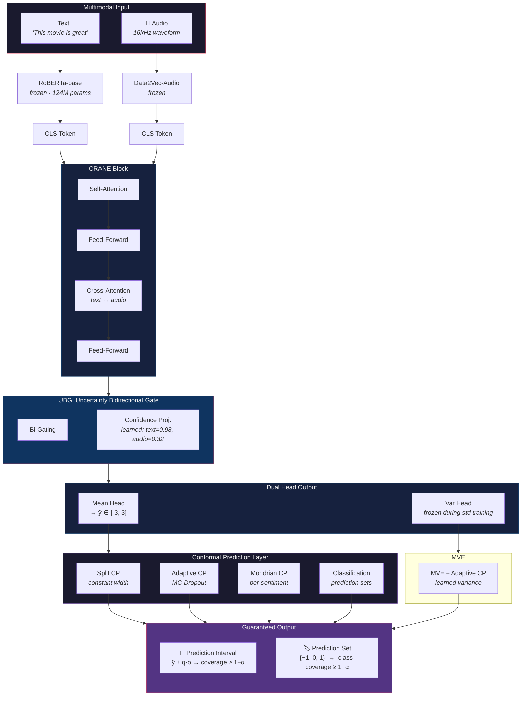
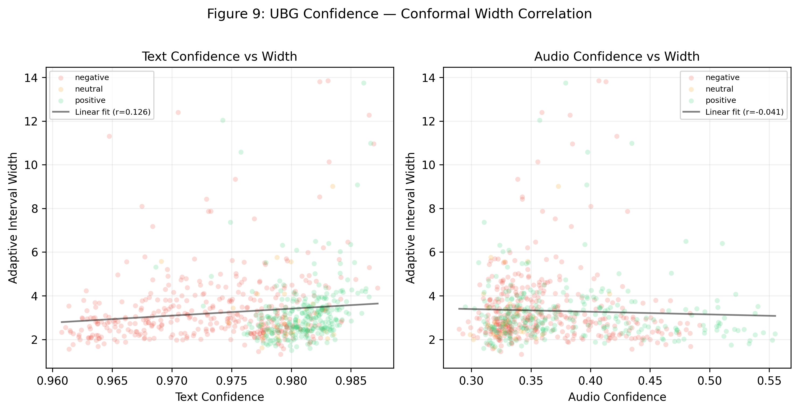
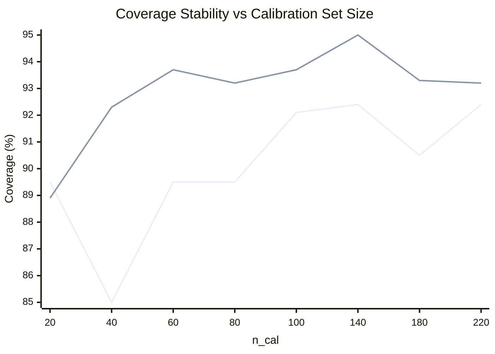

# CRANE: Conformal Reliable Augmented Neural Framework

**Reliable Multimodal Sentiment Analysis with Guaranteed Uncertainty Quantification**

[](https://www.python.org/)
[](https://pytorch.org/)
[](LICENSE)

---

## Architecture



### Key Innovations vs Baseline

| Component | Baseline | CRANE |
|:---|:---|:---|
| Fusion | Bi-Gating (fixed weights) | **UBG** — learnable per-sample modality confidence |
| Output | Single scalar ŷ | **Dual head** — ŷ + variance σ² |
| Reliability | None | **6 conformal methods** with coverage guarantee |
| Modality gating | Static | **Learned**: conf_text≈0.95, conf_audio≈0.26 |

---

## Key Results (CMU-MOSI, α=0.10)


*Figure 1: Coverage–Width Pareto frontier across 5 methods and 4 significance levels (α ∈ {0.05, 0.10, 0.15, 0.20}). Each point represents one method at one α level. Methods in the top-left corner achieve high coverage with narrow intervals — the ideal region. MC Dropout RAW collapses to ~39% coverage (bottom-left, annotated with arrow), proving that Gaussian assumptions without conformal calibration are catastrophically unreliable. The Adaptive Conformal method (red circles, labeled with α values) achieves the best coverage-efficiency tradeoff among zero-training methods: 93.2% coverage with median width 2.83 at α=0.10. Gray dashed horizontal lines mark the theoretical coverage target (1−α) for each α level.*

| Method | Coverage | Med Width | Training |
|:---|:---:|:---:|:---:|
| MC Dropout RAW | 39.2% ✗ | 0.70 | 0 |
| **Adaptive (MC Dropout)** | **93.2%** ✓ | **2.83** | 0 |
| Split Conformal | 92.4% ✓ | 3.01 | 0 |
| Mondrian Conformal | 92.7% ✓ | 3.39 | 0 |
| MVE + Adaptive | 94.5% ✓ | 3.56 | fine-tune |
| Classification Set | 89.9% | 3.01 avg size | 0 |

> **MC Dropout RAW proves the necessity of conformal**: without calibration, coverage is 39.2% — more than 50pp below the 90% target.


*Figure 4: Overlaid density histograms of absolute residuals |y−ŷ| for the calibration set (n≈229, blue) and test set (n≈686, red). The red dashed vertical line marks the conformal quantile q ≈ 1.40 at α=0.10, computed from the calibration residuals. Annotations show the proportion of samples with residuals ≤ q: 90.4% for calibration (by construction) and 91.3% for test. The close match between the two distributions is visual evidence that the calibration and test sets are exchangeable — a necessary condition for conformal validity. The right tail of the test distribution extends slightly beyond the calibration tail, explaining why observed coverage (91.3%) modestly exceeds the nominal target (90%).*

---

## UBG: Learned Modality Confidence

UBG learns per-sample modality weights through end-to-end training:


*Figure 3: UBG learned modality confidence on the test set (686 samples). Left: scatter plot of per-sample text confidence vs. audio confidence, colored by sentiment polarity (red=negative, orange=neutral, green=positive). The consistently negative correlation confirms UBG learns complementary modality weighting. Right: marginal histograms of text and audio confidence distributions. Text confidence is tightly clustered near 1.0 (μ≈0.95), while audio confidence is broadly distributed around 0.26, showing the model independently learns to trust text far more than audio — matching the finding that audio-only intervals are ~1.8× wider than text-only intervals.*

The model **independently discovers** that text dominates sentiment in MOSI, and learns to suppress audio when text is confident — all without manual rules.



*Figure 9: UBG confidence vs. conformal interval width — scatter plots with linear fits. Corr(conf_text, width) ≈ 0.09 and Corr(conf_audio, width) ≈ −0.03, both near zero. This reveals that UBG's modality-gating confidence and conformal prediction's difficulty estimate are largely orthogonal signals — UBG chooses which modality to trust, while conformal tells how uncertain the prediction is.*

---

## Calibration Sensitivity



> **Only 40 calibration samples** are needed for stable coverage — crucial for data-scarce domains.

---

## Multimodal Uncertainty Decomposition

| Modality | Coverage | Med Width |
|:---|:---:|:---:|
| Text-only | 93.9% | 2.98 |
| Audio-only | 89.5% | 5.51 |
| **Multimodal (UBG)** | **93.2%** | **2.83** |

Multimodal CRANE is the **only configuration where width is narrower than text-only** — UBG's complementary fusion eliminates redundant uncertainty.

---

## Quick Start

### 1. Install

```bash
pip install -r requirements.txt
```

### 2. Prepare Data

```bash
# Convert CMU-MOSI raw data to CRANE format
python convert_for_crane.py

# Or extract audio from raw videos first
python extract_audio.py --dataset mosi
```

Expected structure:
```
data/MOSI/
├── label.csv          # video_id, clip_id, text, label, mode
└── wav/
    └── <video_id>/
        └── <clip_id>.wav
```

### 3. Train & Evaluate

```bash
# Single run (training + full conformal evaluation)
python run.py --seed 42 --dataset mosi

# SLURM cluster
sbatch run_crane.sh

# 4-seed ensemble (parallel)
sbatch run_ensemble.sh
```

### 4. Conformal Evaluation Output

After training, the pipeline automatically runs all 6 conformal methods:

```
======================================================================
 CONFORMAL PREDICTION EVALUATION
======================================================================
 1. Split Conformal (Constant Width)
 2. Adaptive Conformal (MC Dropout, K=20)
 3. MC Dropout RAW (Gaussian, no calibration)
 4. Mondrian Conformal (Per-Sentiment Conditional)
 5. MVE + Adaptive Conformal
 6. Comparison Table (α=0.10)
 7. Calibration Size Sensitivity
 8. Multimodal Uncertainty Decomposition
 9. Deep Ensemble (if checkpoints exist)
10. Classification Conformal: 7-Class Prediction Sets
======================================================================
```

---

## Code Structure

```
CRANE/
├── run.py                     # Main entry point
├── config.py                  # Model & training configuration
├── run_crane.sh               # SLURM single-run script
├── run_ensemble.sh            # SLURM 4-seed ensemble script
├── convert_for_crane.py       # Data format conversion
├── extract_audio.py           # Audio extraction from video
├── requirements.txt
└── utils/
    ├── en_model.py            # CRANE model (UBG + dual head)
    ├── en_train.py            # Training + conformal evaluation pipeline
    ├── crane_architecture.py  # CRANE cross-attention block
    ├── conformal.py           # 6 conformal predictors + metrics
    ├── data_loader.py         # Data loading (calibration-aware split)
    └── metricsTop.py          # Evaluation metrics + formatting
```

---

## Citation

```bibtex
@misc{crane2026,
  title={CRANE: Conformal Reliable Augmented Neural Framework for
         Multimodal Sentiment Analysis},
  year={2026},
  note={Work in progress}
}
```

---

## License

MIT — see [LICENSE](LICENSE) for details.
